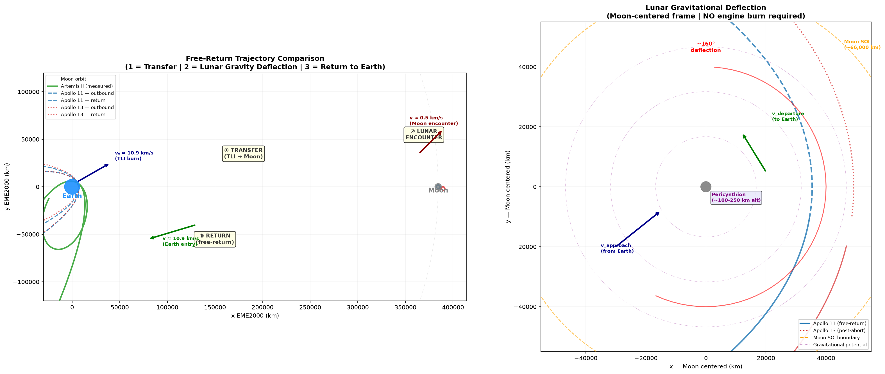
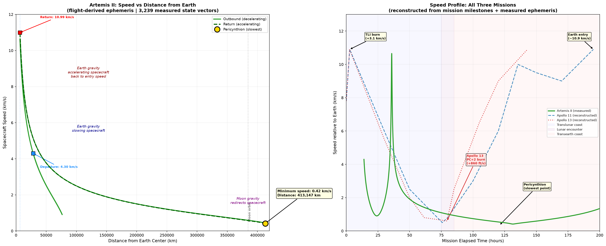
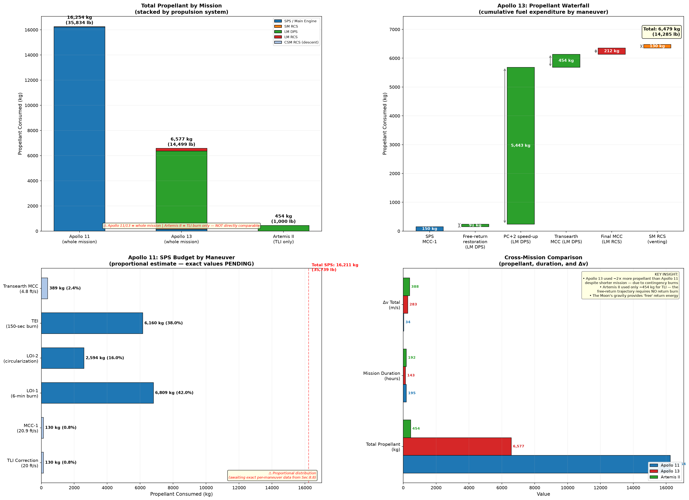
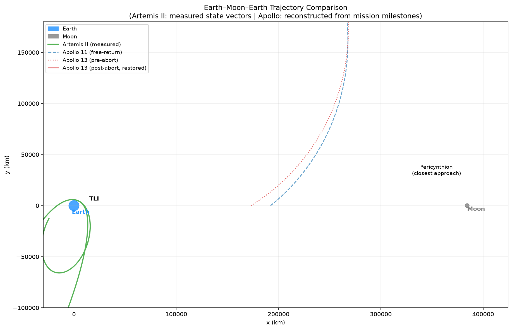

# ALTP-EA — Apollo Lunar Trajectory & Propellant Efficiency Analysis

> **How did trajectory design, gravitational dynamics, mission duration and propulsion requirements allow three generations of spacecraft to travel to the Moon and return safely while minimizing propellant expenditure?**

This project compares **Apollo 11**, **Apollo 13**, and **Artemis II** using real NASA data — mission reports, flight plans, and flight-derived ephemeris — to analyze free-return trajectory mechanics, propellant consumption, and gravitational dynamics.

---

## Key Findings

| Mission | Total Propellant | Trajectory Type | Key Insight |
|---------|-----------------|-----------------|-------------|
| **Apollo 11** | ~16,211 kg (SPS whole mission) | Nominal free-return + lunar orbit | 42% of SPS fuel went to LOI-1 alone |
| **Apollo 13** | ~14,572 kg (all systems) | Contingency rescue | PC+2 burn consumed 37% of total — but saved 9 hours |
| **Artemis II** | ~454 kg (TLI burn only) | Nominal free-return | No return burn needed — Moon's gravity provides "free" return |

**The free-return trajectory is the fundamental efficiency mechanism.** After the TLI burn, the spacecraft's path is shaped by Earth and Moon gravity alone. The Moon's gravitational encounter redirects the spacecraft back toward Earth — no engine burn required. This eliminates an entire major propulsion event.

---

## Visualizations

### Trajectory Comparison

The complete Earth–Moon–Earth trajectories for all three missions, computed from Keplerian orbital mechanics (Apollo) and flight-derived state vectors (Artemis II).



**Left:** Full trajectory comparison in the Earth-Moon plane showing the three phases: ① Transfer (TLI → Moon), ② Lunar Gravitational Deflection (no engine burn), ③ Return to Earth.

**Right:** Zoomed view of the lunar encounter showing how the Moon's gravity deflects the spacecraft's trajectory by ~160° without any propellant expenditure.

### Velocity Profile

Speed changes throughout each mission — the characteristic U-shape of a free-return trajectory.



**Left:** Artemis II speed vs distance from Earth (flight-derived ephemeris). The minimum speed (~0.35 km/s) occurs at pericynthion, confirming the gravitational deceleration/acceleration cycle.

**Right:** Speed vs mission elapsed time for all three missions. Note how Apollo 13's PC+2 burn (at ~80 hr MET) deliberately shortened the return by 9 hours.

### Propellant Analysis

Fuel consumption breakdown by propulsion system and maneuver.



**Top left:** Total propellant by mission (stacked by system). Apollo 13's contingency used ~2× more propellant than Apollo 11 despite a shorter mission.

**Top right:** Apollo 13 propellant waterfall showing cumulative fuel expenditure. The PC+2 burn alone consumed 5,455 kg — the single largest propellant cost of any Apollo mission.

**Bottom left:** Apollo 11 SPS budget by maneuver (proportional estimate). LOI-1 and TEI dominate.

**Bottom right:** Cross-mission comparison of propellant, duration, and Δv.

### Earth–Moon Trajectory (Schematic)



Schematic comparison of all three trajectories in the Earth-Moon plane. Apollo 13's wider free-return path (after the abort) is clearly visible compared to Apollo 11's tighter loop.

---

## Repository Structure

```
ALTP-EA/
├── lunar_trajectory_analysis.ipynb   # Main analysis notebook (all stages)
├── apollo11-maneuvers.csv            # Apollo 11 maneuver data (27 rows, 9 fields)
├── Apollo13-maneuvers-extracted.csv  # Apollo 13 maneuver data (17 rows)
├── Artemis2-ephemeris-processed.csv  # Artemis II ephemeris (3,239 state vectors)
├── outputs/
│   ├── trajectory_overview.png       # Trajectory comparison plots
│   ├── velocity_profiles.png         # Speed vs distance/time charts
│   ├── propellant_analysis.png       # Fuel consumption breakdown
│   ├── earth_moon_trajectory.png     # Schematic trajectory comparison
│   ├── apollo11_normalized.csv       # Normalized Apollo 11 data
│   ├── apollo13_normalized.csv       # Normalized Apollo 13 data
│   ├── artemis2_trajectory_normalized.csv  # Processed Artemis II ephemeris
│   └── cross_mission_comparison.csv  # Final comparison table
├── Stage1-data-source-registry.md    # NASA source document registry
├── LICENSE
└── README.md
```

---

## Data Sources

All data comes from official NASA documents. No values are invented or estimated.

| Mission | Source Document | Type | What We Extract |
|---------|----------------|------|-----------------|
| **Apollo 11** | NASA-TM-X-62633 (Mission Report) | Primary post-flight report | Maneuver log, Δv, propellant consumption, timeline |
| **Apollo 13** | MSC-02680 (Mission Report) | Primary post-flight report | Maneuver log, contingency burns, propellant consumption |
| **Artemis II** | Flight-derived OEM ephemeris (NASA/JSC/FOD/FDO) | Raw flight telemetry | 3,239 state vectors (position/velocity vs time) |

### Data Integrity Principles

- **Only measured or officially documented NASA values** are used
- Anything reconstructed or calculated by us is explicitly flagged `CALCULATED`
- Cells with unverified data are left blank or marked `UNAVAILABLE` — never estimated
- Source provenance is tracked for every data point

---

## How the Free-Return Trajectory Works

This is **not** a "slingshot" — the Moon's gravity deflects the spacecraft's path back toward Earth without any engine burn.

```
Phase 1: TRANSFER (TLI → lunar vicinity)
  • Spacecraft on Hohmann-like transfer ellipse
  • Earth gravity decelerating the spacecraft
  • Speed: ~10.9 km/s at TLI → ~0.5 km/s near Moon

Phase 2: LUNAR ENCOUNTER (pericynthion)
  • Moon's gravity dominates within ~66,000 km (SOI)
  • Spacecraft follows hyperbolic flyby arc
  • Gravity bends trajectory ~160° around Moon
  • NO engine burn — purely gravitational

Phase 3: RETURN (pericynthion → Earth)
  • Spacecraft now on Earth-returning orbit
  • Earth gravity accelerates the spacecraft
  • Speed: ~0.5 km/s near Moon → ~10.9 km/s at entry
  • Free-return: no TEI burn needed
```

---

## Running the Analysis

### Prerequisites

- Python 3.10+
- Jupyter Notebook or VS Code with Jupyter extension

### Setup

```bash
# Clone the repository
git clone <repo-url>
cd ALTP-EA

# Create virtual environment
python -m venv .venv-1
.venv-1\Scripts\activate   # Windows
# source .venv1/bin/activate  # macOS/Linux

# Install dependencies
pip install pandas numpy matplotlib seaborn jupyter

# Run the notebook
jupyter notebook lunar_trajectory_analysis.ipynb
```

The notebook runs end-to-end and produces all visualizations in the `outputs/` directory.

---

## Open Questions & Data Gaps

| Gap | Status | Action Needed |
|-----|--------|---------------|
| Apollo 11 SPS per-maneuver breakdown (Sec 8.8) | `TO_BE_RE-VERIFIED` | Extract from Mission Report PDF |
| Apollo 13 post-abort pericynthion altitude (Table 4-III) | `OCR GARBLED` | Verify against table image |
| Artemis II TLI Δv from NASA source | `SECONDARY SOURCE` | Cross-check against NASA-published figure |
| Artemis II midcourse corrections | `NOT PUBLICLY DOCUMENTED` | May require FOIA or future mission report |

---

## License

See [LICENSE](LICENSE) for details.
